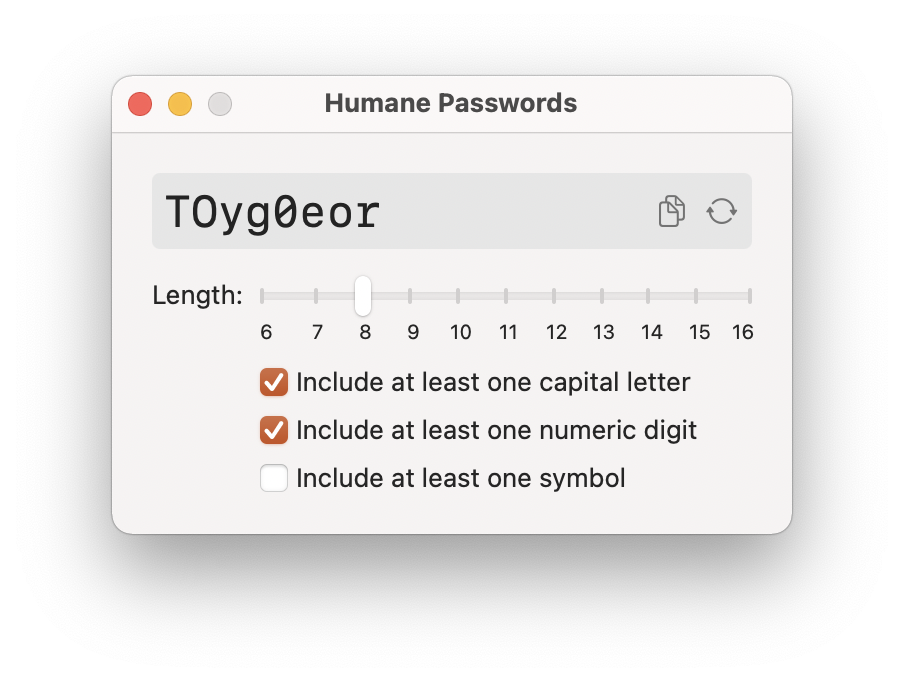

#  Humane Passwords

Simple utility for generating reasonably secure passwords that mimic the structure of English words making them easier to remember and less frustrating to type than more typical secure password generators.

Most of the time using a long password with a lot of randomness is the best choice. By design passwords like that are not intended to remembered or typed by hand frequently.

However, there are times when a password is needed that **must be** entered manually, sometimes frequently, and possibly on a mobile device. In these instances, the long, secure passwords most password generators like the one built into Safari create are not a good choice.

The goal of this utility is to create passwords with a reasonable degree of randomness that are easier to remember and type. It will generate passwords like the samples below:

* `slee7Xui`
* `Awo5auff`
* `tAodge2s`
* `TOyg0eor`

Choose whether to include capital letters, numbers, or symbols and set the length of the password. Use the buttons or menu shortcuts to copy (Cmd-C) or regenerate (Cmd-N) the password until you find one you like.

 ## Download

TODO: app store link here

Requires macOS 11.0 or newer.
